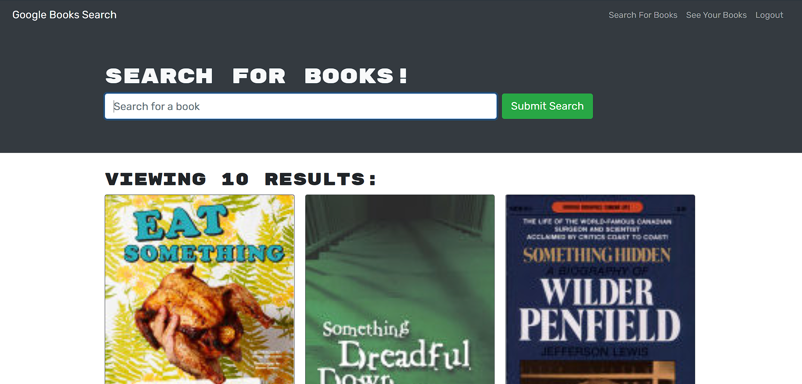

# Book Search Engine

App to search for books on Google and save them to your list

## Table of Contents

- [Installation](#installation)

- [Usage](#usage)

- [Contributing](#contributing)

- [Tests](#tests)

- [Questions](#questions)

## Installation

copy files to your server, run npm i

## Usage

Used to save your books for later reading

## Contributing

Bradley Kimbrell

## Tests

none

## Questions

<a href="https://github.com/brouiller">Github for brouiller</a>

<a href="mailto:bradley.kimbrell@gmail.com">Send me an email if you have any questions.</a>
